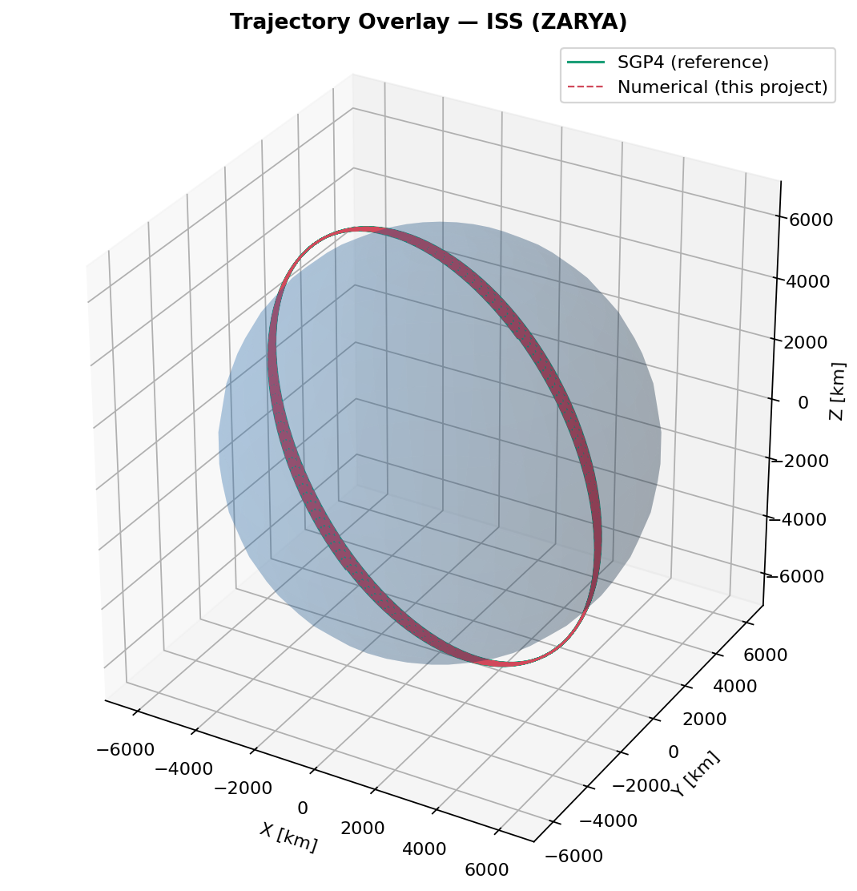
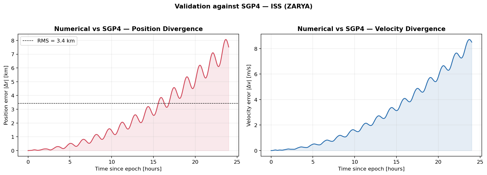
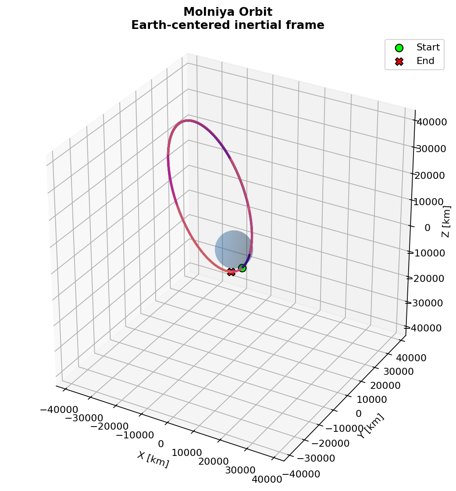
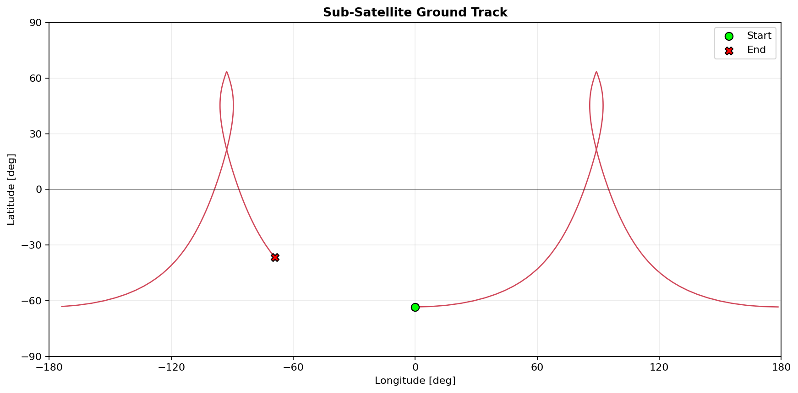
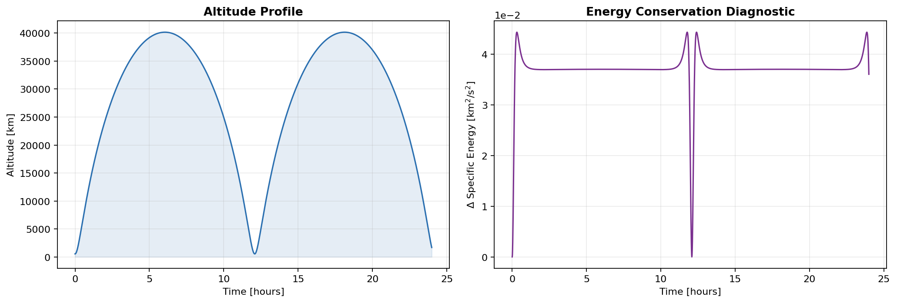

# 🛰️ Satellite Orbit Simulator

[](https://github.com/seshankbagavath/satellite-orbit-simulator/actions/workflows/tests.yml)
[](https://www.python.org/)
[](LICENSE)

Predict where a satellite goes. This project propagates orbital trajectories in
Python — integrating the two-body equations of motion with **J2 oblateness** and
**atmospheric drag** — and backs the result up by validating it against **real
satellite tracking data**. It ships with an interactive 3D web app, a test
suite, and continuous integration.

> **Difficulty:** Advanced · **Core topics:** Orbital mechanics, numerical methods

---

## 🌐 Try it now — no install

**[▶ Launch the interactive web app](https://seshankbagavath.github.io/satellite-orbit-simulator/)**

Drag sliders to reshape an orbit and watch it update live in 3D. Load real
satellites — ISS, Hubble, GPS, Molniya, geostationary, polar — each with its own
model, and toggle the J2 precession effect. The physics is ported straight from
the Python engine and runs entirely in your browser.

## ✅ Validated against real data

The propagator isn't just plausible-looking — its accuracy is measured. Using a
real ISS Two-Line Element set, it's compared head-to-head against **SGP4**, the
analytic propagator the tracking community actually uses. Both start from the
identical epoch state, so the divergence over time reflects the physics model
alone.

| Force model | RMS position error vs SGP4 (24 h) |
|---|---:|
| Two-body **+ J2** | **~3.4 km** |
| Two-body only | ~621 km |

Adding the single J2 term improves agreement by roughly **180×** — a concrete
demonstration of why Earth's equatorial bulge is the dominant perturbation in
low Earth orbit. The remaining few-km drift comes from effects SGP4 includes and
this model intentionally doesn't (drag tuning, higher-order harmonics).

| Trajectory overlay | Error growth over 24 h |
|---|---|
|  |  |

## ✨ What it does

- **Converts orbital elements to motion** — classical Keplerian elements to an
  ECI state vector and back, accurate to machine precision.
- **Propagates with a high-order integrator** — adaptive 8th-order `DOP853`
  Runge–Kutta via SciPy, at tight `1e-9` tolerances.
- **Models the real perturbations** — J2 zonal harmonic (nodal regression and
  apsidal precession) and exponential-atmosphere drag with planetary co-rotation.
- **Detects re-entry** — propagation halts automatically at the surface.
- **Analyzes and visualizes** — orbital period, an energy-conservation
  diagnostic, Earth-rotation-aware ground tracks, plus 3D trajectory and
  altitude/energy plots.
- **Plans orbital maneuvers** — Hohmann and bi-elliptic transfer planners and a
  universal-variable **Lambert solver**, validated against textbook results
  (Curtis 5.2 to four decimals). The web app draws both transfer paths live and
  shows which method wins on delta-v at a given radius ratio.

## 📊 Example output

| 3D trajectory | Ground track |
|---|---|
|  |  |



## 🚀 Getting started

**Google Colab** — open `satellite_orbit_simulator.ipynb` and run all cells.

**Locally:**

```bash
pip install -r requirements.txt
python satellite_orbit_simulator.py
```

**In your own code:**

```python
from satellite_orbit_simulator import (
    OrbitalElements, PropagatorConfig, propagate, orbital_period,
    plot_orbit_3d, plot_ground_track, EARTH,
)

# An ISS-like low Earth orbit.
elem = OrbitalElements.from_degrees(
    a=EARTH.radius + 420, e=0.0006, i=51.64, raan=60, argp=0, nu=0,
)

period = orbital_period(elem.a, EARTH.mu)
result = propagate(elem, duration_s=3 * period,
                   cfg=PropagatorConfig(use_j2=True))

plot_orbit_3d(result)
plot_ground_track(result)
```

To reproduce the SGP4 validation:

```python
from orbit_validation import run_validation_demo

# Fetches a live TLE from Celestrak; falls back to an embedded one if offline.
run_validation_demo(catalog_number=25544, duration_hours=24)
```

## 📐 How the physics works

The state vector **x** = [r, v] evolves under three accelerations:

```
r̈ = -μ·r/|r|³  +  a_J2(r)  +  a_drag(r, v)
```

| Term | Model |
|---|---|
| Two-body | Newtonian point-mass gravity |
| J2 | Second zonal harmonic, `J2 = 1.0826×10⁻³` |
| Drag | Exponential atmosphere (7.249 km scale height), co-rotating |

Integration uses SciPy's `solve_ivp` with the 8th-order `DOP853` scheme. The
specific-energy diagnostic doubles as a quality check: in a pure two-body run the
drift sits near machine precision, while with J2 the small periodic variation is
genuine physics rather than numerical error.

## 🧪 Tests

A `pytest` suite of 33 tests covers element↔state round trips, known orbital
values (ISS period, geostationary period, Kepler's third law), conservation of
energy and angular momentum, J2 perturbation behavior, input validation, and the
maneuver routines (Hohmann/bi-elliptic delta-v and the Lambert solver against
Curtis 5.2). GitHub Actions runs the suite on Python 3.10–3.12 on every push.

```bash
pip install -r requirements.txt pytest
pytest
```

## ⚠️ Assumptions & limitations

- Bound orbits only (`0 ≤ e < 1`); no hyperbolic or parabolic trajectories.
- Exponential atmosphere is an engineering approximation, best in the
  ~150–1000 km regime.
- Earth orientation is modeled as uniform rotation (no nutation or precession).
- No third-body, solar-radiation-pressure, or higher-order gravity terms — left
  out by design, and straightforward to extend.

## 📁 Project structure

```
satellite-orbit-simulator/
├── .github/workflows/
│   └── tests.yml                # CI: runs pytest on Python 3.10–3.12
├── docs/
│   └── index.html               # Interactive web app (GitHub Pages)
├── tests/
│   ├── test_orbit_simulator.py  # propagator tests
│   └── test_maneuvers.py        # transfer / Lambert tests
├── satellite_orbit_simulator.py     # Core library + demos
├── satellite_orbit_simulator.ipynb  # Core Colab notebook
├── orbit_validation.py              # SGP4 validation pipeline
├── orbit_validation.ipynb           # Validation Colab notebook
├── orbital_maneuvers.py             # Hohmann / bi-elliptic / Lambert
├── pytest.ini
├── requirements.txt
├── README.md
└── LICENSE
```

The web app lives in `docs/` so GitHub Pages can serve it directly from that
folder.

## 📜 License

MIT — see [LICENSE](LICENSE).
